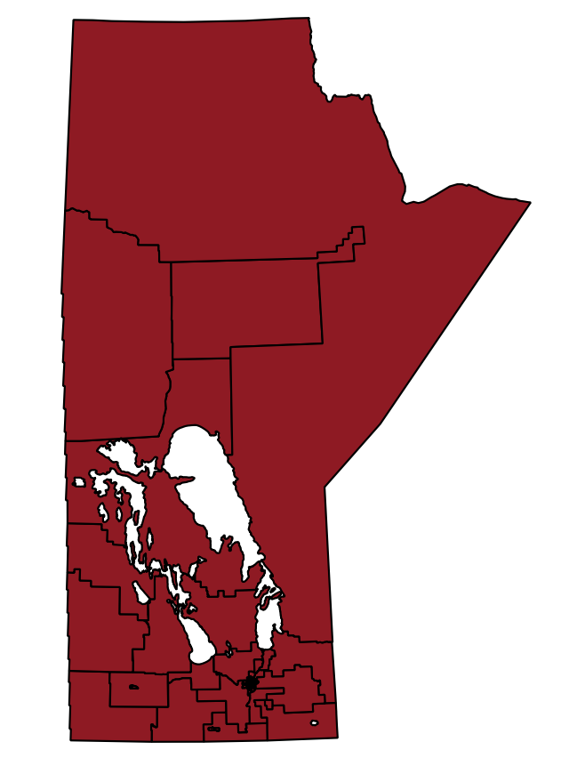

# PostGIS examples: MGUG 2019 conference
A mini tutorial on some basic GIS transformations using PostGIS functions.
This was created and presented at the 2019 Manitoba GIS user Group conference in Winnipeg by Jacques Marcoux.

<b>Requirements:</b> 
(1) 
In order to execute these queries, you first need to install Postgresql, along with the PostGIS add-on. 
 
(2) 
Create a blank database, and then execute the following to initiate PostGIS within that database to enable the storing of spatial data 
-- Enable PostGIS 
<b>CREATE EXTENSION postgis;</b> 
 
(3) 
Once PostGIS enabled, you need to upload the spatial data and non-spatial data to your postgresql database 
 
(4) 
From here, you can then use the queries in the repository to test out PostGIS functions 
 
<b>Exercise 1:</b> 
Transform vector data using Postgis

We will see how to take a vector file of electoral boundaries of the province of Manitoba: 
 

Then take a vector file of a selection of key waterways: 
 

And use PostGIS functions to transform the original map by using the water layer as a "cookie cutter" 
 

<b>Exercise 2:</b> 
Find out which election candidate lives in or out of the riding in which they are running and for those living outside of their riding, how far away are they located.
Note that the listed home addresses for candidates were published in the Winnipeg Free Press in August 2019 by Elections Manitoba as per the <a href="https://web2.gov.mb.ca/laws/statutes/ccsm/e030e.php">Manitoba Elections Act</a>.

The resuting story can be read here:
https://www.cbc.ca/news/canada/manitoba/manitoba-election-candidate-ridings-1.5267157
