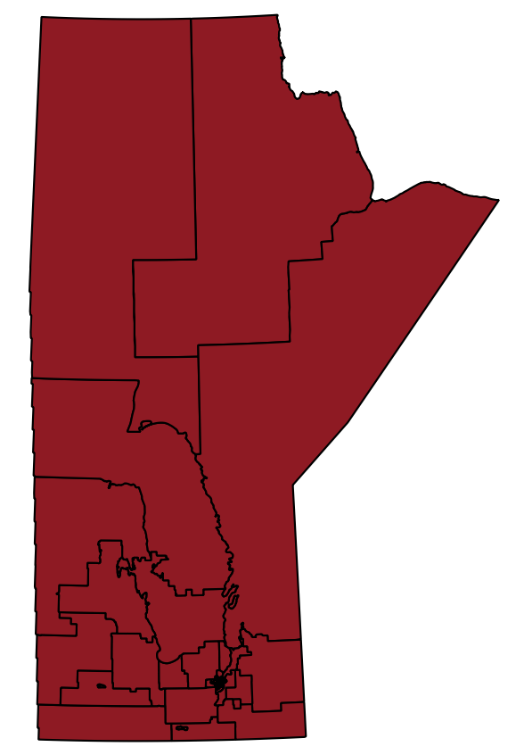
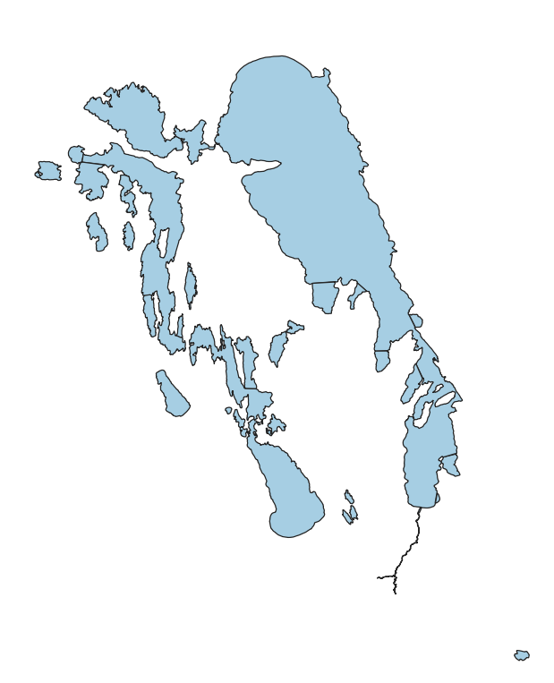

# PostGIS examples: MGUG 2019 conference
A mini tutorial on some basic GIS transformations using PostGIS functions.
This was presented at the 2019 Manitoba GIS user Group conference in Winnipeg.

Exercise 1: transform vector data using Postgis

We will see how to take a vector file of electoral bounaries of the province of Manitoba:

Then take a vector file of a selection of key waterways:

